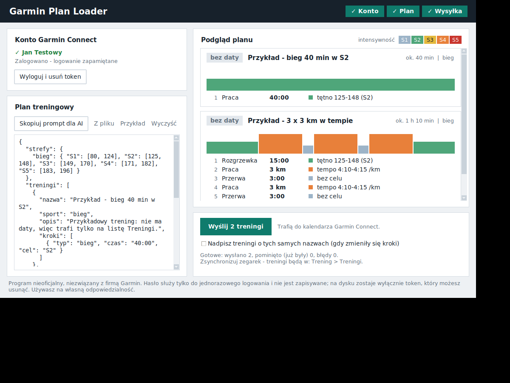

# Garmin Plan Loader

Proste okienko do wgrywania **planu treningowego od trenera** do **Garmin Connect** – razem z datami w kalendarzu, tak żeby treningi same pojawiły się na zegarku po synchronizacji.

Bez terminala, bez instalowania Pythona. Pobierasz, uruchamiasz, logujesz się, wklejasz plan, wysyłasz.

> ⚠️ **Program nieoficjalny.** Nie jest związany z firmą Garmin ani przez nią wspierany. Korzysta z nieoficjalnej biblioteki [python-garminconnect](https://github.com/cyberjunky/python-garminconnect), która może przestać działać po zmianach po stronie Garmina. Używasz na własną odpowiedzialność, zgodnie z regulaminem Garmin Connect.



## Jak używać

1. **Pobierz** program z zakładki [Releases](../../releases) (Windows: `GarminPlanLoader-Windows.zip`, Mac: wersja Apple Silicon lub Intel) i go rozpakuj.
2. **Zaloguj się** e-mailem i hasłem do Garmin Connect (jeśli masz włączone MFA – wpisz kod z e-maila/SMS/aplikacji, gdy program o niego poprosi).
3. **Skopiuj prompt** przyciskiem „Skopiuj prompt dla AI”, wklej go do swojego asystenta AI (ChatGPT, Claude, Gemini…) razem z planem od trenera i swoimi strefami tętna. AI zwróci plan w formacie JSON.
4. **Wklej JSON** do okna programu. Podgląd pojawia się sam: każdy trening jako karta z wykresem intensywności i listą kroków – **sprawdź go, zanim wyślesz**.
5. **Wyślij.** Treningi trafią do Garmin Connect (Trening → Treningi) i do kalendarza. Zsynchronizuj zegarek.

Przycisk „Przykład” wstawia gotowy przykładowy plan, żeby zobaczyć, jak to działa.

Kolejny tydzień? Wklej nowy plan i wyślij – treningi o tej samej nazwie nie są dublowane, a jeśli zmieniła się data, wpis w kalendarzu jest przestawiany. Zaznacz „Nadpisz”, gdy zmieniły się same kroki.

## Format planu

```json
{
  "strefy": {
    "bieg": { "S1": [80, 124], "S2": [125, 148], "S3": [149, 170], "S4": [171, 182], "S5": [183, 196] }
  },
  "treningi": [
    {
      "nazwa": "3 x 3 km @ 4:10-4:15",
      "sport": "bieg",
      "data": "2026-10-06",
      "kroki": [
        { "typ": "rozgrzewka", "czas": "15:00", "cel": "S2" },
        { "powtorz": 3, "kroki": [
            { "typ": "interwal", "dystans": "3 km", "cel": "4:10-4:15" },
            { "typ": "przerwa",  "czas": "3:00",    "cel": "S1" }
        ]},
        { "typ": "schlodzenie", "czas": "10:00", "cel": "S1" }
      ]
    },
    { "data": "2026-10-07", "wolne": true }
  ]
}
```

- **Cel kroku:** strefa (`S1`–`S5`, wg Twojej tabeli), zakres tętna (`HR 150-160`), tempo (`4:10-4:15`), dla roweru moc (`200-220W`) albo brak celu.
- Krok ma **czas** albo **dystans**, nigdy oba.
- Prawidłowy prompt do swojego AI dostajesz przyciskiem w programie – nie musisz pisać formatu ręcznie.

## Prywatność i bezpieczeństwo

- Hasło służy tylko do jednorazowego zalogowania, **nie jest zapisywane** i nie jest nigdzie wysyłane poza serwery Garmina.
- Na dysku zostaje wyłącznie **token logowania** w folderze `.garmin-plan-loader` w katalogu domowym (możesz zdjąć ptaszek „Zapamiętaj” albo użyć „Wyloguj i usuń token”).
- Program nie ma żadnej telemetrii ani własnego serwera. Kod jest w tym repozytorium – możesz go przeczytać.

## Ostrzeżenia przy pierwszym uruchomieniu

Program nie jest podpisany certyfikatem (to kosztuje), więc system może go ostrzegać:

- **Windows (SmartScreen):** „Windows ochronił ten komputer” → **Więcej informacji → Uruchom mimo to**. Niektóre antywirusy mogą fałszywie alarmować przy programach spakowanych PyInstallerem; możesz uruchomić program ze źródeł (niżej).
- **macOS (Gatekeeper):** kliknij program **prawym przyciskiem → Otwórz → Otwórz**. Jeśli to nie pomaga: Ustawienia systemowe → Prywatność i ochrona → „Otwórz mimo to”.

## Uruchomienie ze źródeł

Wymaga Pythona 3.10+ z tkinter.

```bash
pip install -r requirements.txt
python app.py
```

Testy: `pip install pytest && python -m pytest tests`

## Budowanie

Paczki buduje GitHub Actions (`.github/workflows/build.yml`) dla Windows i macOS. Wydanie powstaje po wypchnięciu tagu `vX.Y.Z`.

## Licencja

MIT – zobacz [LICENSE](LICENSE).
